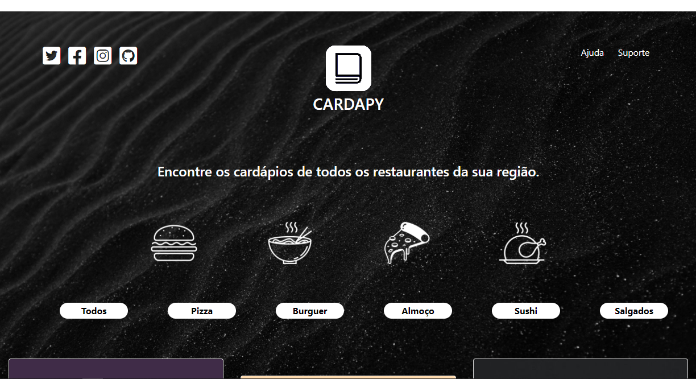

<h1 align="center">
 
  
 
</h1>

Aplicação web destinada ao público interessado por deliverys. Neste projeto, os usuários poderão acessar os todos os cardápios da sua região em um só lugar.

  

## 🚀 Tecnologias

Este projeto foi desenvolvido com o auxílio das tecnologias:

- ✔️ Php

- ✔️ Laravel

- ✔️ Composer

- ✔️ Bootstrap 

## 🙋🏾‍♂️ Autor  
João Erick Barbosa

## 😉 Onde me encontrar?

 
